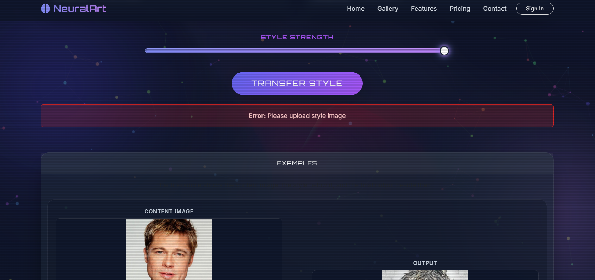
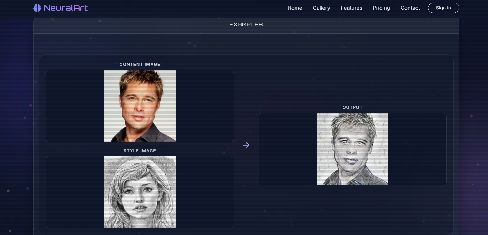
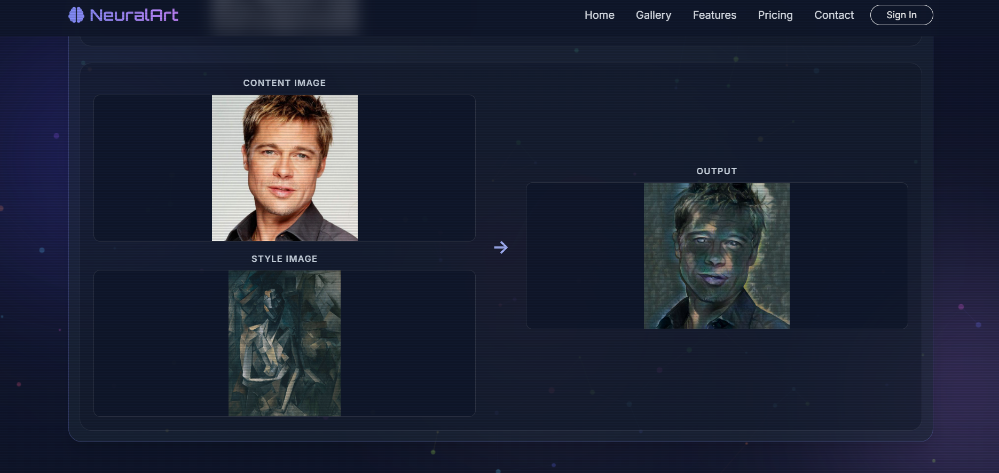
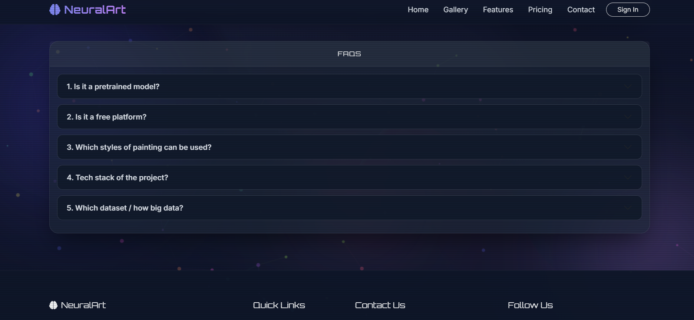
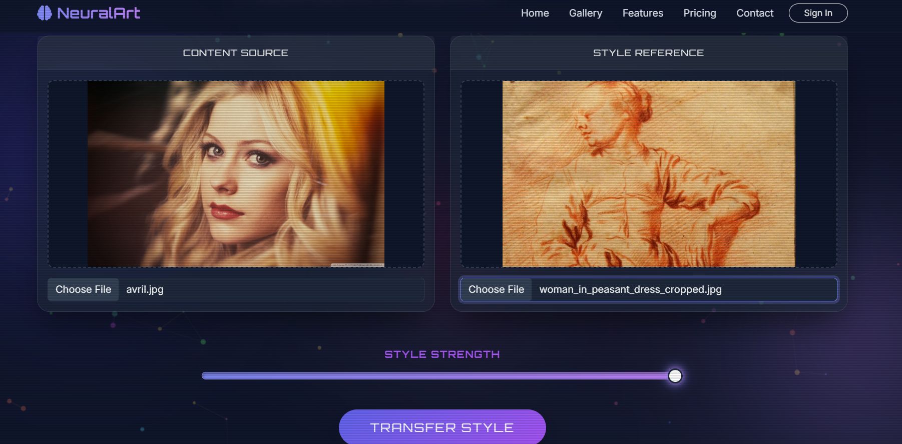
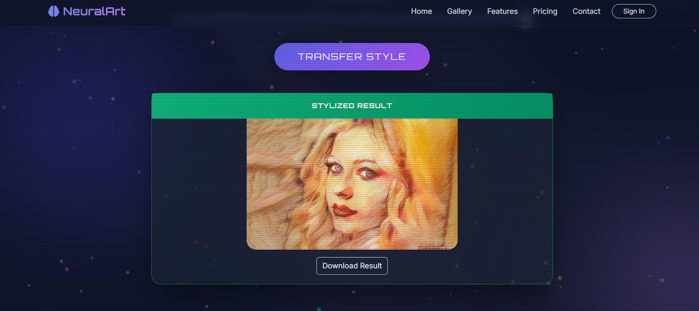

# 🎨 Neural Style Transfer

<p align="center">
  
</p>

<p align="center">
  <b>Transform ordinary photographs into artistic masterpieces using Deep Learning and PyTorch.</b>
</p>

<p align="center">
A Flask-based web application that combines the content of one image with the artistic style of another using Neural Style Transfer.
</p>

---

## 🎥 Demo

📹 **Project Demonstration**

> *Demo video will be added soon.*

---

## 📷 Project Preview

> *Animated GIF preview will be added soon.*

<!--

-->

---

# 📖 About the Project

Neural Style Transfer (NST) is a Deep Learning technique that generates artistic images by combining the **content of one image** with the **style of another**.

This project provides a user-friendly web application where users can:

- Upload a content image
- Upload a style image
- Adjust the style intensity
- Generate an artistic image
- Download the stylized result

The application is built using **Flask** for the web interface and **PyTorch** for deep learning inference.

---

# ✨ Features

- 🖼 Upload Content Image
- 🎨 Upload Style Image
- 🎛 Adjustable Style Strength
- ⚡ Fast Image Generation
- 📥 Download Generated Image
- 💻 Responsive User Interface
- 🧠 Powered by PyTorch Deep Learning
- ☁ Docker & Cloud Deployment Ready

---

# 🛠 Tech Stack

| Category | Technologies |
|-----------|--------------|
| Frontend | HTML5, CSS3, Bootstrap |
| Backend | Flask |
| Deep Learning | PyTorch, TorchVision |
| Image Processing | Pillow |
| Deployment | Docker, Render |
| Version Control | Git, GitHub |

---

# 🧠 How It Works

1. Upload a **Content Image**.
2. Upload a **Style Image**.
3. Adjust the **Style Strength**.
4. Click **Generate**.
5. The model extracts content and style features.
6. Adaptive Instance Normalization combines both representations.
7. Download the generated artistic image.

---

# 🏗 Model Architecture

```text
Content Image
       │
       ▼
Feature Extraction
       │
       │
Style Image
       │
       ▼
Encoder
       │
       ▼
Adaptive Instance Normalization (AdaIN)
       │
       ▼
Decoder
       │
       ▼
Stylized Output
```

---

# 📂 Project Structure

```text
Neural-Style-Transfer/
│
├── images/
│   ├── banner.png
│   ├── home1.png
│   ├── home2.png
│   ├── home3.png
│   ├── home4.png
│   ├── home5.png
│   ├── upload.png
│   └── output.png
│
├── NST_Code/
│
├── static/
│   ├── uploads/
│   ├── outputs/
│   └── styles/
│
├── templates/
│
├── app.py
├── Dockerfile
├── requirements.txt
├── README.md
└── .gitignore
```

---

# 🚀 Installation

## Clone the Repository

```bash
git clone https://github.com/Harshitha-kh/Neural-Style-Transfer.git
```

## Navigate to the Project

```bash
cd Neural-Style-Transfer
```

## Install Dependencies

```bash
pip install -r requirements.txt
```

## Run the Application

```bash
python app.py
```

Open your browser and visit:

```
http://127.0.0.1:5000
```

---

# 📸 Application Screenshots

## 🏠 Home Pages


---



---



---



---




## 📤 Upload Content & Style Images



---

## 🖌 Generated Output



---

# 📈 Future Enhancements

- Multiple Artistic Styles
- GPU Acceleration
- Image Comparison Slider
- User Authentication
- Image History
- Gallery of Generated Images
- Batch Image Processing
- Mobile Optimization

---

# 🙏 Acknowledgements

The project has been customized and extended with:

- Flask-based web application
- Image upload and download functionality
- Adjustable style strength
- Improved user interface
- Docker deployment support
- Comprehensive GitHub documentation

Special thanks to the PyTorch community and open-source contributors for providing valuable learning resources.

---

# 👩‍💻 Author

**Harshitha Kuchana**

B.Tech – Computer Science Engineering

GitHub: **https://github.com/Harshitha-kh**

---

# ⭐ Support

If you found this project useful, please consider giving it a ⭐ on GitHub.

Your support motivates me to build and share more open-source projects.

---

<p align="center">
Made with ❤️ using Flask, PyTorch and Deep Learning
</p>

It helps others discover the project and motivates further improvements.
