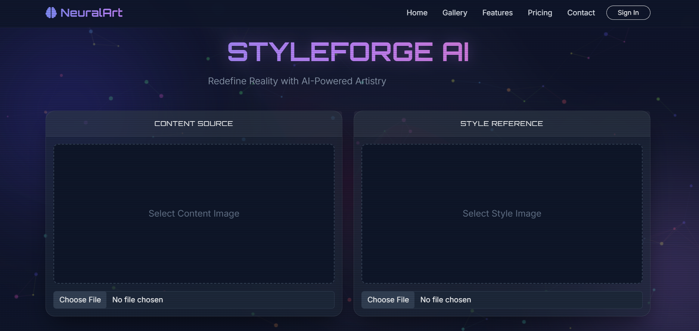

# 🎨 Neural Style Transfer

<p align="center">
  
</p>

<p align="center">

Transform ordinary photographs into artistic artwork using Deep Learning and PyTorch.

</p>

---

## 🎥 Demo

📹 **Project Demonstration**

> *(Demo video link will be added here.)*

---

## 📷 Project Preview

> *(GIF preview will be added here.)*

```markdown

```

---

# 📖 About the Project

Neural Style Transfer is a Deep Learning application that merges the **content of one image** with the **style of another** to generate artistic images.

This project provides an easy-to-use web interface where users can upload their own content and style images, adjust the style intensity, and download the generated artwork.

The application is built using **Flask** and **PyTorch**, making advanced deep learning accessible through a simple browser interface.

---

# ✨ Features

- Upload Content Image
- Upload Style Image
- Adjustable Style Strength
- Real-time Image Generation
- Download Generated Image
- Responsive User Interface
- Deep Learning powered by PyTorch
- Ready for Cloud Deployment

---

# 🛠 Tech Stack

| Category | Technologies |
|----------|--------------|
| Frontend | HTML, CSS, Bootstrap |
| Backend | Flask |
| Deep Learning | PyTorch, TorchVision |
| Image Processing | Pillow |
| Deployment | Docker, Render |
| Version Control | Git, GitHub |

---

# 🧠 How It Works

1. Upload a Content Image.
2. Upload a Style Image.
3. Select the desired style strength.
4. The model extracts content and style features.
5. Neural Style Transfer combines both representations.
6. Download the generated artistic image.

---

# 🏗 Project Architecture

```text
Content Image
       │
       ▼
Feature Extraction
       │
       │
Style Image
       │
       ▼
Encoder
       │
       ▼
Adaptive Instance Normalization
       │
       ▼
Decoder
       │
       ▼
Stylized Output
```

---

# 📂 Project Structure

```text
Neural-Style-Transfer/
│
├── NST_Code/
├── static/
│   ├── uploads/
│   ├── outputs/
│   └── styles/
│
├── templates/
│
├── app.py
├── requirements.txt
├── Dockerfile
├── README.md
└── .gitignore
```

---

# 🚀 Installation

### Clone Repository

```bash
git clone https://github.com/Harshitha-kh/Neural-Style-Transfer.git
```

### Enter Directory

```bash
cd Neural-Style-Transfer
```

### Install Dependencies

```bash
pip install -r requirements.txt
```

### Run Application

```bash
python app.py
```

Open your browser:

```
http://127.0.0.1:5000
```

---

# 📸 Screenshots

## 🏠 Home Page

> *(Add Screenshot Here)*

---

## 📤 Upload Images

> *(Add Screenshot Here)*

---

## 🎨 Generated Output

> *(Add Screenshot Here)*

---

## 📥 Download Result

> *(Add Screenshot Here)*

---

# 📈 Future Enhancements

- Multiple Style Selection
- GPU Acceleration
- User Authentication
- Image Gallery
- History of Generated Images
- Batch Processing
- Mobile Optimization

---

# 🙏 Acknowledgements

This project is inspired by research in Neural Style Transfer and utilizes PyTorch for deep learning implementation.

---

# 👩‍💻 Author

**Harshitha Kuchana**

B.Tech Computer Science Engineering Student

GitHub:
https://github.com/Harshitha-kh

---

# ⭐ Support

If you found this project useful, please consider giving it a ⭐ on GitHub!

It helps others discover the project and motivates further improvements.
